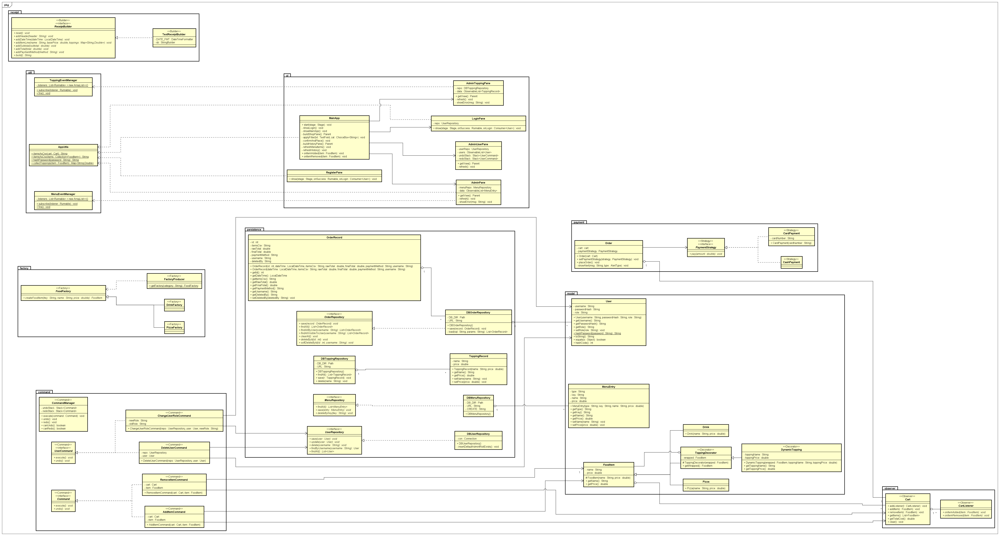

# Start Document – Online Food Ordering App

**Instructor:** Gerjan Van Oenen  
**Institution:** NHL Stenden University of Applied Sciences  
**Academic Year:** 2024–2025  

**Group Members:**  
1. Abu Hasib Shanewaz  
2. Md Kaiser Aftab  

---

## Problem Description

Modern restaurants and food businesses need a flexible digital platform to manage menu offerings and receive online orders efficiently. Customers expect to browse a menu, customize their meals, and pay easily. Restaurant staff require tools to update menus, track orders, and ensure a smooth operation.  
The **Online Food Ordering App** solves these needs by providing:
- Menu browsing (pizzas, drinks, categories)
- Cart management and customization (add/remove items, toppings)
- Order placement with multiple payment methods
- Role-based admin management for menus, toppings, and categories

The system is built with proven design patterns, ensuring extensibility and maintainability.

---

## Application Description

This project implements an **Online Food Ordering App** where:
- Users can browse food and drink items, add customizations, and place orders
- A shopping cart provides real-time updates and undo/redo functionality
- Orders can be paid with various methods (cash/card)
- Admin users manage the menu, categories, and available toppings
- All data is persisted in an SQLite database, and the user interface is built with JavaFX

---

## MoSCoW Feature Breakdown

| MUST Have                                                            | SHOULD Have                           | COULD Have                         | WON’T Have                         |
|----------------------------------------------------------------------|---------------------------------------|------------------------------------|------------------------------------|
| - Browse menu items (pizza, drinks, etc.)                            | - Multiple payment options (cash/card)| - Dynamic toppings management      | - Real payment gateway integration |
| - Add/remove items to/from cart                                      | - Undo/redo cart actions              | - Admin: Edit/delete users         | - GPS delivery tracking            |
| - View cart with total price                                         | - Order confirmation message          | - Live UI updates for cart/menu    | - Third-party restaurant support   |
| - Place an order                                                     | - View order history                  |                                    |                                    |
| - User authentication (login/register)                               | - Role-based access (admin/user)      |                                    |                                    |
| - Admin: Manage menu, toppings, categories                           |                                       |                                    |                                    |

---

## Definition of Done

| Feature               | Done When…                                                         |
|-----------------------|---------------------------------------------------------------------|
| Menu browse           | User sees a list of pizzas, drinks, and categories                  |
| Add to cart           | User adds item; cart updates and total recalculates automatically   |
| Place order           | User places order and receives a confirmation message               |
| Admin: manage menu    | Admin adds/edits/deletes items and sees menu update instantly       |
| Payment               | User selects a payment method and order is recorded if valid        |
| Undo/Redo cart        | User can undo/redo cart actions, with cart state reverting properly |

---

## MVC Architecture Section

- **Model**:  
  Handles core data and business logic, e.g. `User`, `Order`, `Cart`, `FoodItem`, `Pizza`, `Drink`, `MenuEntry`, `DBMenuRepository`, `DBUserRepository`.
- **View**:  
  JavaFX UI classes, e.g. `MainApp`, `ShopPane`, `AdminPane`, `CartPane`, `PaymentPane`, `OrderHistoryPane`.
- **Controller**:  
  Orchestrates interaction between UI and model, e.g. `MainApp`, JavaFX event handlers (button clicks, form submissions).

---

## Selected Design Patterns and Purpose

| Design Pattern  | Where Used (Classes/Interfaces)                                   | Purpose / Problem Solved                                                                             |
|-----------------|-------------------------------------------------------------------|------------------------------------------------------------------------------------------------------|
| Factory Method  | `FoodFactory`, `DrinkFactory`, `PizzaFactory`                     | Flexible menu item creation without tight coupling to specific classes                               |
| Decorator       | `ToppingDecorator` (and subclasses)                               | Dynamic addition of toppings to food items at runtime                                                |
| Observer        | `Cart`, `CartListener`                                            | Automatic UI and component updates when cart content changes                                         |
| Command         | `AddItemCommand`, `RemoveItemCommand`, `CommandManager`, etc.     | Encapsulation of user actions for undo/redo and code decoupling                                      |
| Strategy        | `PaymentStrategy`, `CashPayment`, `CardPayment`                   | Runtime switchable payment methods without altering core order logic                                  |
| Builder         | `ReceiptBuilder`, `TextReceiptBuilder`                            | Structured receipt creation, allowing future formats or extensions                                   |

---

## UML Class Diagram

See Figure 1 below for the UML class diagram highlighting all classes and pattern usage.

  

---

## Input & Output

### User Inputs

| Case                    | Type         | Conditions                            |
|-------------------------|--------------|---------------------------------------|
| Login/Register          | String       | Username/password, unique, valid      |
| Menu selection          | Selection    | Item must exist in menu               |
| Cart actions            | Button       | Add/remove item, toppings valid       |
| Place order             | Button       | Cart not empty, payment method chosen |
| Admin menu mgmt         | Form         | Valid item/topping/category name      |

### Application Outputs

| Case                    | Type         | Description / Condition               |
|-------------------------|--------------|---------------------------------------|
| Menu display            | List/Table   | Menu items with details shown         |
| Cart display            | List         | All items and toppings in cart        |
| Cart total              | Number       | Sum of all item and topping prices    |
| Order confirmation      | Message      | On successful order                   |
| Order history           | List/Table   | Past orders for user/admin            |
| Admin confirmations     | Message      | Item/topping/category added/removed   |

---

